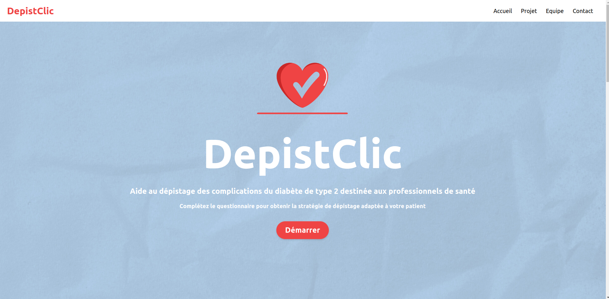
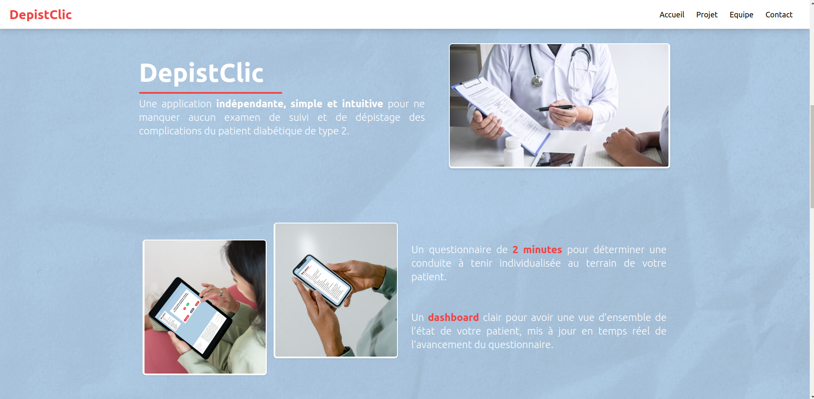
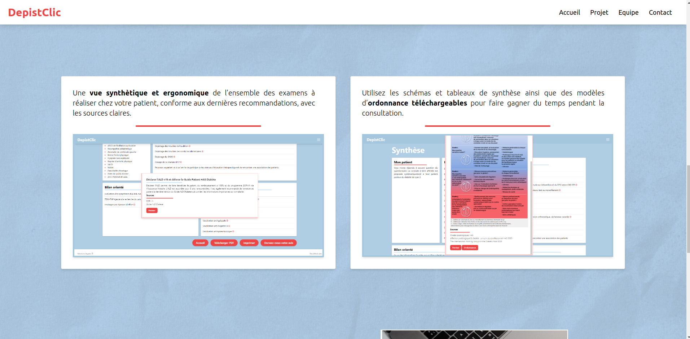
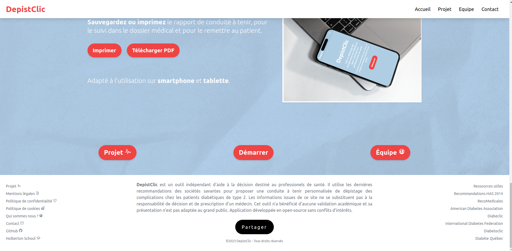

<h2>
    
</h2><br>

## :dart: About DepistClic ##

Decision aid tool to help healthcare professionals screen for complications in patients affected by Diabetes Mellitus Type 2

Help French healthcare professionals make the right decisions, by providing them with an interactive, up-to-date, ergonomic and fast tool to help them decide and plan screening tests for diabetic patients, in order to improve their health.


## :rocket: Technologies ##

The following tools were used in this project:

### Front-end :
<details>
    <summary>
        <b>Click to see more</b>
    </summary>
 <br>
 <br>
 <br>

</details>

### Back-end :
<details>
    <summary>
        <b>Click to see more</b>
    </summary>
 <br>
 <br>
 <br>

</details>

## :white_check_mark: Requirements ##

Before starting :checkered_flag:, you need to have [Git](https://git-scm.com) installed.

## 🏁 Starting ##

```bash
# Clone this project
$ git clone https://github.com/v-dav/DepistClic.git

# Access
$ cd Depistclic

# Activate Virtual Environment
$ pipenv shell

# Install dependencies
$ pipenv install

# Run the project
$ python manage.py runserver

# The server will initialize in the <http://localhost:8000>
```

# 📜 Files
| **File name** | **Folder name** | **Description** |
|:--------|:-----------:|:-----------:|
||[`Images`](https://github.com/v-dav/DepistClic/tree/main/DepistClic/mainapp/static/Images)|Folder containing the site's images|
||[`templates`](https://github.com/v-dav/DepistClic/tree/main/DepistClic/mainapp/templates)|Folder containing all html files|
|`admin.py`||File to configure application administration interface|
|`apps.py`||General configuration file for the Depistclic application|
|`forms.py`||File to define forms|
|`models.py`||File to define database models|
|`urls.py`||File to define application routes (URLs)|
|`views.py`||File to define application views|
|`script.js`||File that manages interaction between front-end and back-end|


# Landing Page







# :writing_hand: Authors

Made with :heart: and :muscle: by :
<h3>
  <a href="https://github.com/v-dav">
    
  </a>
</h3> <h3>
  <a href="https://github.com/Yliaze">
    
  </a>
</h3>

<h3>
  <a href="[https://github.com/v-dav](https://github.com/hug0-cstrs)">
    
  </a>
</h3>

<p align="right">Holberton School - TOULOUSE C20 Cohort JUNE. 2023
</p>
